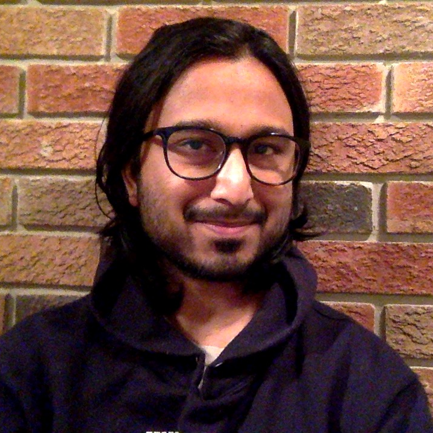
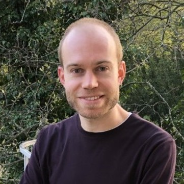
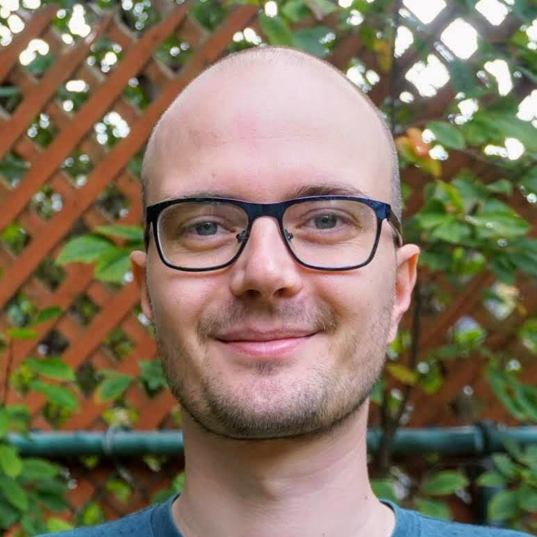
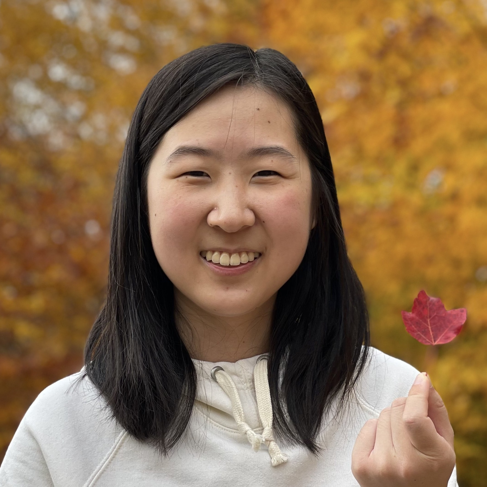
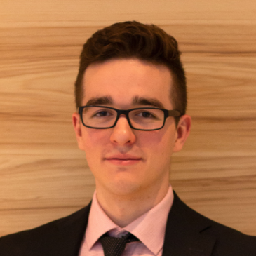
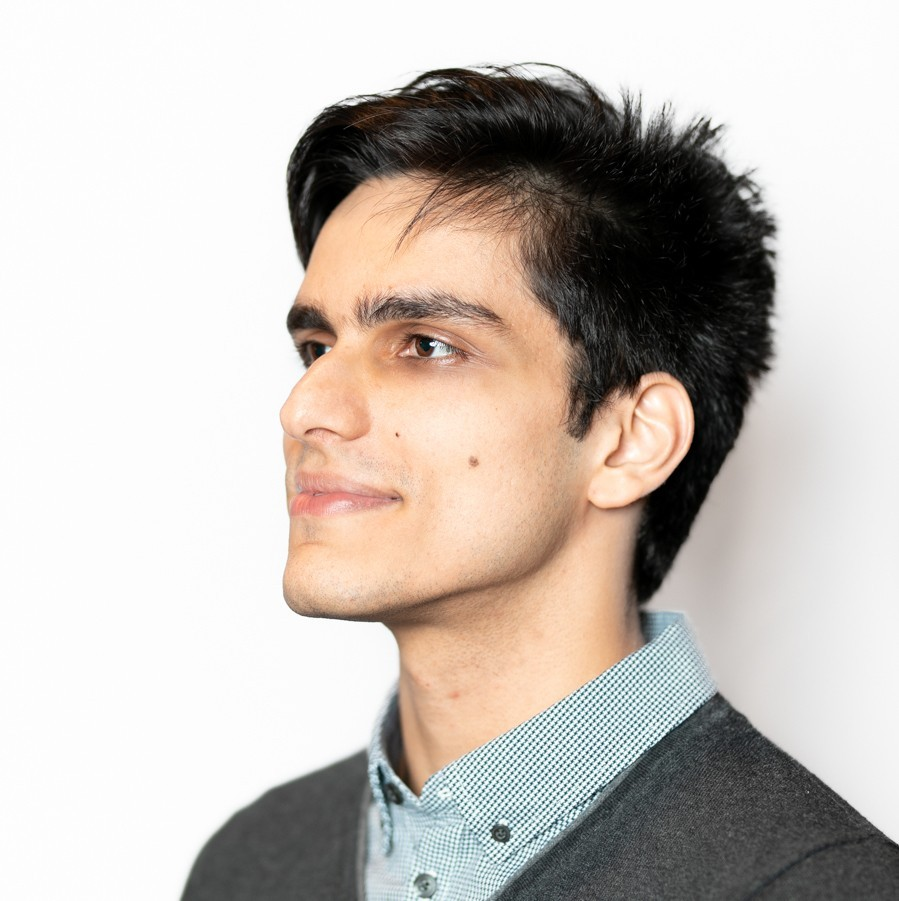

# Infra-core

Meet the people behind the project

## Principal investigators

- { width="80" } **[Ysbrand Van Der Werf](profile/jane-doe)**  
  Amsterdam UMC, The Netherlands
- { width="80" } **[Jean-Baptiste Poline](https://neurodatascience.github.io/)**  
  McGill University, Montreal, Canada  

## Project leads

- { width="80" } **[Eva van Heese](profile/jane-doe)**  
  Amsterdam UMC, The Netherlands  
- { width="80" } **[Nikhil Bhagwat](https://neurodatascience.github.io/)**  
  McGill University, Montreal, Canada  
- { width="80" } **[Emile d'Angremont](profile/jane-doe)**  
  Amsterdam UMC, The Netherlands  
- { width="80" } **[Sebastian Urchs](https://neurodatascience.github.io/)**  
  McGill University, Montreal, Canada  

## Dev leads

- { width="80" } **[Michelle Wang](https://michellewang.github.io/)**  
  McGill University, Montreal, Canada  
- { width="80" } **[Alyssa Dai ](https://neurodatascience.github.io/)**  
  McGill University, Montreal, Canada  
- { width="80" } **[Mathieu Dugré](https://mathdugre.me/)**  
  Concordia University, Montreal, Canada  
- { width="80" } **[Arman Jahanpour](https://github.com/rmanaem)**  
  McGill University, Montreal, Canada  

<!-- ...existing cards section... -->