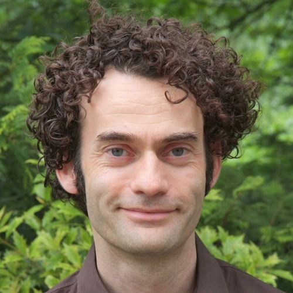
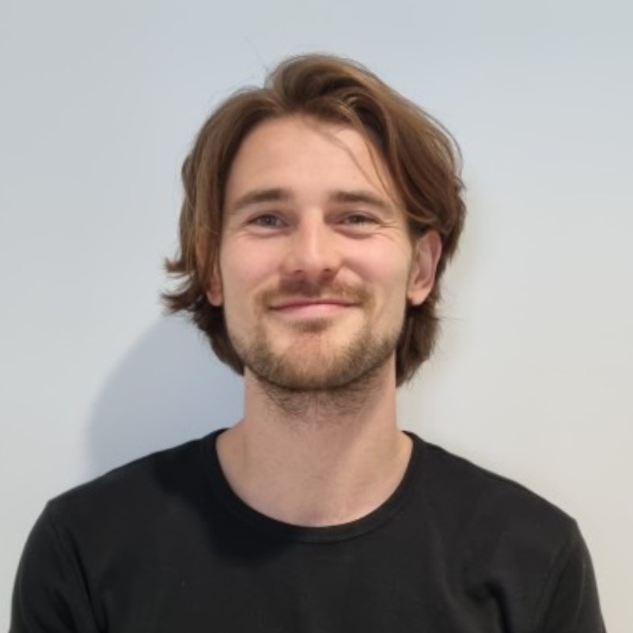
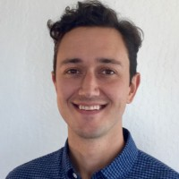
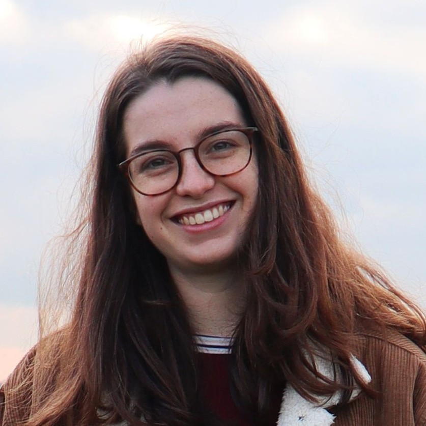
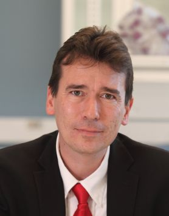
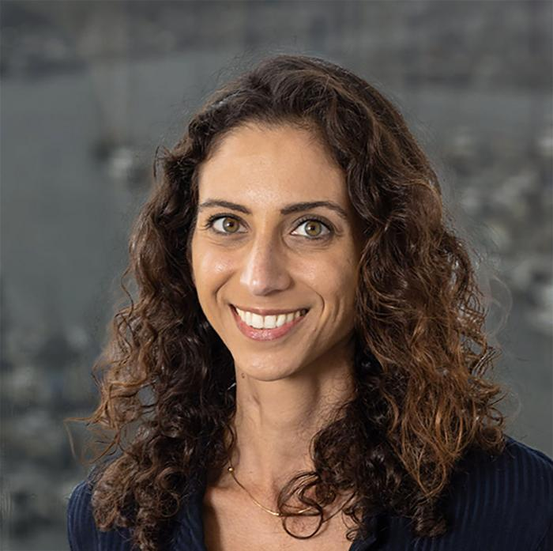

# ENIGMA-PD Core Team

Meet the people behind ENIGMA-PD!

- { width="80" } **[Ysbrand van der Werf](https://pure.amsterdamumc.nl/en/persons/ysbrand-van-der-werf)**  
  Amsterdam UMC, The Netherlands
- { width="80" } **[Max Laansma](https://pure.amsterdamumc.nl/en/persons/max-laansma)**  
  Amsterdam UMC, The Netherlands
- { width="80" } **[Conor Owens-Walton](https://profiles.sc-ctsi.org/conor.owens-walton)**  
  University of Southern California, USA
- { width="80" } **[Eva van Heese](https://pure.amsterdamumc.nl/en/persons/eva-van-heese)**  
  Amsterdam UMC, The Netherlands
- { width="80" } **[Paul Thompson](https://keck.usc.edu/faculty-search/paul-m-thompson/)**  
  University of Southern California, USA
- { width="80" } **[Neda Jahanshad](https://keck.usc.edu/faculty-search/neda-jahanshad/)**  
  University of Southern California, USA
- { width="80" } **[Emile d'Angremont](https://pure.amsterdamumc.nl/en/persons/emile-dangremont)**  
  Amsterdam UMC, The Netherlands

